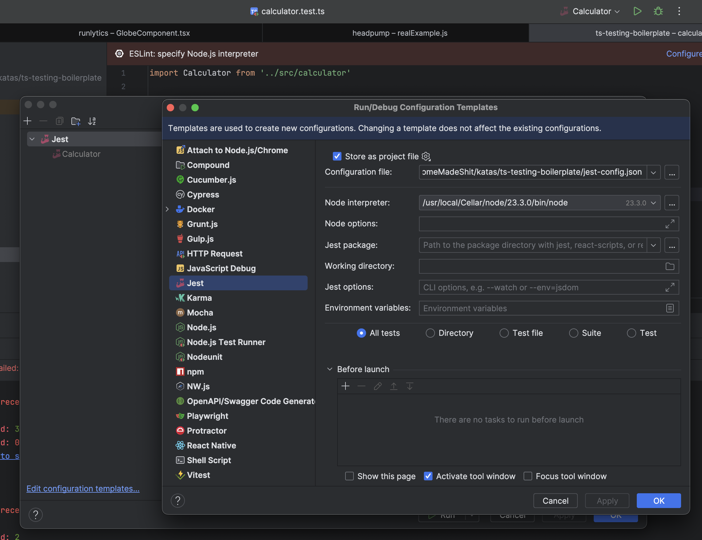

## Typescript testing boilerplate

A minimal boilerplate for starting TypeScript projects with testing and linting tools.

## Features

- **TypeScript**: Write strongly-typed JavaScript.
- **Jest**: Fast and feature-rich testing framework.
- **ESLint**: Static code analysis to catch errors.
- **Prettier**: Consistent code formatting.

## Requirements

- **Node.js**: v20 or newer.
- **Yarn**: Installed globally.

## Getting Started

### Install Dependencies

```bash
yarn
```

### Run Tests

- Execute all tests:

  ```bash
  yarn test
  ```

- Watch files and re-run tests on changes:

  ```bash
  yarn test:watch
  ```

### Lint Code

- Check for linting issues:

  ```bash
  yarn lint
  ```

- Fix linting issues:

  ```bash
  yarn lint --fix
  ```

## IntelliJ IDEA Setup
- Adjust node version: `Preferences` -> `Languages & Frameworks` -> `Node.js and NPM` and set the `Node interpreter` to the path of your Node.js installation.
  - Configure jest: `Run/debug configurations` -> `Add new configuration` -> `Jest` and set the `Jest package` to the path of your `jest` installation.'

    

## Scripts

| Command           | Description                        |
|-------------------|------------------------------------|
| `yarn test`       | Run all tests.                     |
| `yarn test:watch` | Run tests in watch mode.           |
| `yarn lint`       | Check for linting issues.          |
| `yarn lint --fix` | Fix linting issues automatically.  |

## Folder Structure

```
tdd-ts/
├── src/                # Source code
├── test/               # Test files
├── .eslintignore       # Files to ignore during linting
├── eslint.config.js    # ESLint configuration
├── jest.config.json    # Jest configuration
├── tsconfig.json       # TypeScript configuration
├── package.json        # Project metadata and scripts
└── README.md           # Documentation
```

## License

This project is licensed under the [MIT License](LICENSE).

### Made with ❤️ by [540](https://540deg.com)
